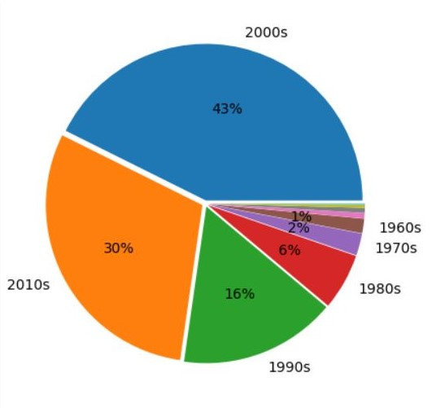
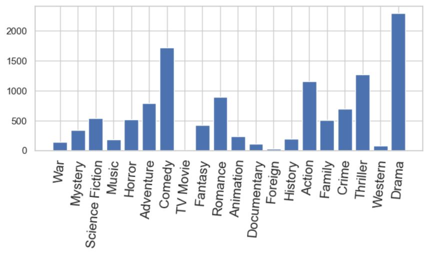
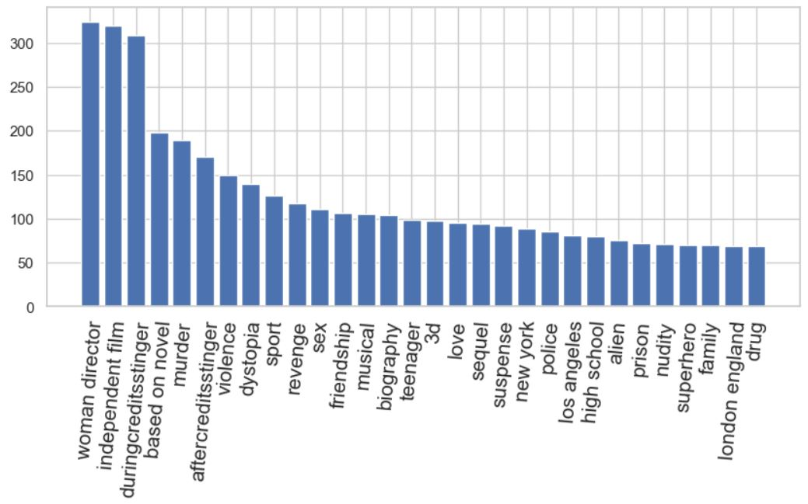
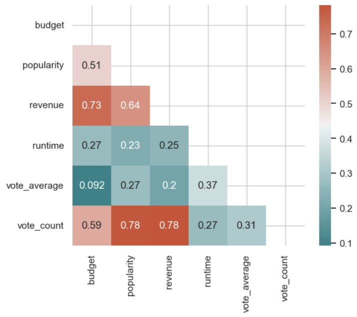

# Movie Recommendation System

This repository contains a movie recommendation system built using content-based and popularity-based approaches. The system utilizes a dataset comprising over 4800 movies, extracted from two CSV files: `movies.csv` and `credits.csv`.

## Dataset Description
- **movies.csv**: Contains various attributes of movies such as budget, genres, keywords, popularity, release date, revenue, etc.
- **credits.csv**: Includes details about the cast and crew of each movie.

## Steps Implemented
1. **Data Extraction**: Extracted data from the provided CSV files.
2. **Data Transformation**: Transformed raw data into a usable format for analysis.
3. **Data Cleaning and Preprocessing**: Cleaned the data to handle missing values, duplicates, etc.
4. **Data Visualization**: Visualized the dataset to gain insights and identify patterns.
5. **Genre Analysis**: Analyzed movie genres to understand their distribution and popularity.
6. **Keyword Analysis**: Explored keywords associated with movies to extract meaningful information.
7. **Genre Word Cloud Visualization**: Created word clouds based on movie genres for better visualization.
8. **Correlation Analysis**: Investigated correlations between different attributes of movies.
9. **Feature Combination**: Combined relevant features to enhance the recommendation system.
10. **Index Mapping**: Mapped movie indices for efficient retrieval and recommendation.
11. **Movie Recommendation**:
    - **Based on Cosine Similarity with CountVectorizer**: Utilized CountVectorizer to calculate similarity between movies.
    - **Based on Cosine Similarity with TF-IDF**: Employed TF-IDF (Term Frequency-Inverse Document Frequency) for improved recommendation.

## Analysis






## Technologies Used


## How to Use

To use the movie recommendation system in your Jupyter Notebook, follow these steps:

1. **Clone the Repository**: Clone this repository to your local machine using Git.

    ```bash
    git clone https://github.com/dwivedi717/Movies_Recommendations.git
    ```

2. **Python**: Ensure Python is installed on your system.
3. **Virtual Environment**: Set up a virtual environment to manage dependencies and isolate your project's environment from other Python projects. You can create a virtual environment using `virtualenv` or `venv`.
4. **requirements.txt**: Install the required Python dependencies by running the command:
  ```
  pip install -r requirements.txt
  ```
5. **Open Jupyter Notebook**: Navigate to the directory where you cloned the repository and launch Jupyter Notebook.

    ```bash
    cd Movie-Recommendation-System
    jupyter notebook
    ```

6. **Run the Notebook**: Open the Jupyter Notebook file (`movie_recommendation.ipynb`) and run each cell sequentially. Make sure to follow the instructions provided within the notebook.

7. **Explore and Enjoy**: Once all the cells are executed, you can explore the movie recommendation system, analyze the dataset, and test the recommendation algorithms.

8. **Customize and Extend**: Feel free to customize the notebook, tweak parameters, or extend functionality based on your requirements. 
